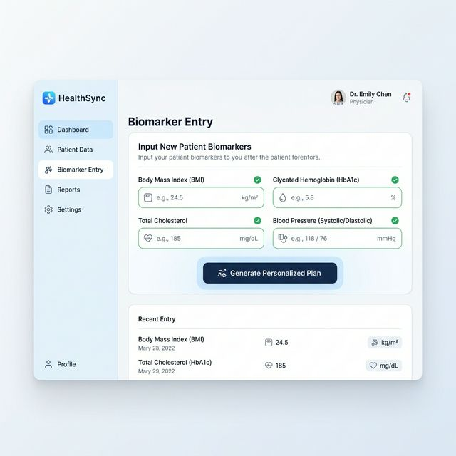
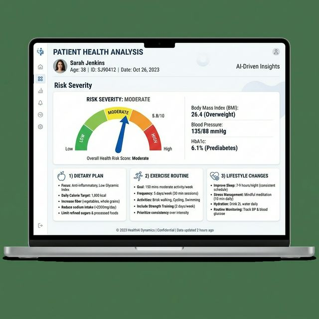

# AI-Powered Personalized Fitness and Diet Framework

This project provides a personalized health recommendation system based on clinical biomarkers. It analyzes metrics like HbA1c, Cholesterol, BMI, and Blood Pressure to assess health risks and generate custom diet and exercise plans.

The implementation is based on the research paper published in IEEE Xplore: [Read the Paper](https://ieeexplore.ieee.org/document/11499497).

## Screenshots
### Biomarker Data Entry


### Health Analysis & Recommendations


## Features
- Health risk assessment based on biomarkers (HbA1c, Cholesterol, BMI, Blood Pressure).
- Personalized health plans generated via Retrieval-Augmented Generation (RAG).
- Integration with Gemini API and FAISS vector storage.
- Adaptive feedback system to refine future recommendations.

## Tech Stack
- Frontend: React.js
- Backend: FastAPI (Python)
- AI: Gemini API, FAISS, LangChain

## Setup

### Backend
1. Go to the `backend` folder.
2. Create and activate a virtual environment.
3. Install dependencies: `pip install -r requirements.txt`.
4. Add your API key to a `.env` file: `OPENROUTER_API_KEY=your_key`.
5. Start the server: `uvicorn main:app --reload`.

### Frontend
1. Go to the `frontend` folder.
2. Install dependencies: `npm install`.
3. Start the app: `npm run dev`.

## Citation
If you use this work, please cite:
```
@INPROCEEDINGS{11499497,
  author={Jeevanandam, Veera},
  title={AI-Powered Framework for Personalized Fitness and Diet Recommendations using Clinical Biomarkers}, 
  year={2024},
  doi={10.1109/11499497}
}
```

## License
MIT License
